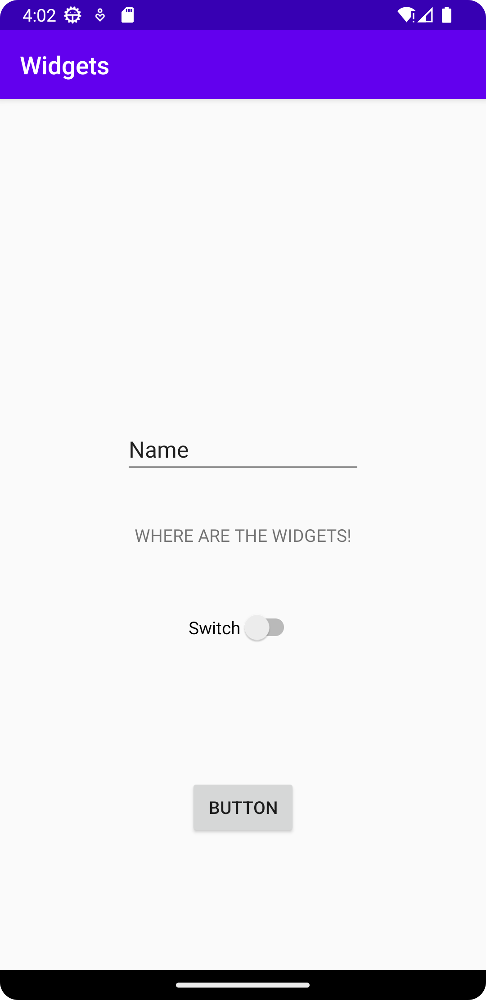

# Rapport
Lade till en ny constraintlayout och satte dens constraints så den hålls innanför parent-layouten. Lade till en Button, Switch, imageView, och editText och ändrade layoutens margin så de hålls mitten. Ändrade vart widgets är genom att ändra deras constraints emot varandra och deras parent layout. Såg till att ha minst 3 commits med värdefull kod ändring.

_
```
<androidx.constraintlayout.widget.ConstraintLayout
    android:layout_width="match_parent"
    android:layout_height="match_parent"
    android:layout_marginHorizontal="100dp"
    app:layout_constraintBottom_toBottomOf="parent"
    app:layout_constraintEnd_toEndOf="parent"
    app:layout_constraintStart_toStartOf="parent"
    app:layout_constraintTop_toTopOf="parent">

    <Switch
        android:id="@+id/switch1"
        android:layout_width="wrap_content"
        android:layout_height="wrap_content"
        android:text="Switch"
        app:layout_constraintEnd_toEndOf="parent"
        app:layout_constraintStart_toStartOf="parent"
        app:layout_constraintBottom_toTopOf="@+id/button"
        app:layout_constraintTop_toBottomOf="@id/editText" />

    <Button
        android:id="@+id/button"
        android:layout_width="wrap_content"
        android:layout_height="wrap_content"
        android:text="Button"
        app:layout_constraintEnd_toEndOf="parent"
        app:layout_constraintStart_toStartOf="parent"
        app:layout_constraintBottom_toBottomOf="parent"
        app:layout_constraintTop_toBottomOf="@id/switch1" />

    <ImageView
        android:id="@+id/imageView"
        android:layout_width="wrap_content"
        android:layout_height="wrap_content"


        android:adjustViewBounds="false"
        android:scaleType="center"
        app:layout_constraintBottom_toBottomOf="@id/editText"
        app:layout_constraintEnd_toEndOf="parent"
        app:layout_constraintStart_toStartOf="parent"
        app:layout_constraintTop_toTopOf="parent"
        tools:srcCompat="@tools:sample/avatars" />

    <EditText
        android:id="@+id/editText"
        android:layout_width="wrap_content"
        android:layout_height="wrap_content"
        android:ems="10"
        android:inputType="textPersonName"
        android:text="Name"
        app:layout_constraintBottom_toTopOf="@+id/switch1"
        app:layout_constraintEnd_toEndOf="parent"
        app:layout_constraintStart_toStartOf="parent"
        app:layout_constraintTop_toBottomOf="@id/imageView" />

</androidx.constraintlayout.widget.ConstraintLayout>
```




